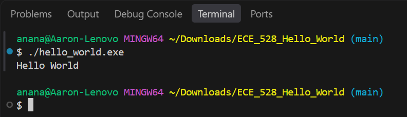

# Overview

This is what we did in the lab.

# Components Used

These are the components that we used:
* Component 1
* Component 2

# Analysis and Results

Screenshot 1:

# Known Issues and Limitations

# Author Contribution

John did the following:
- Task 1
- Task 2

Kyle did the following:
- Nothing (got carried by John)

# References

- [GeeksforGeeks](https://www.geeksforgeeks.org/c/c-functions/)